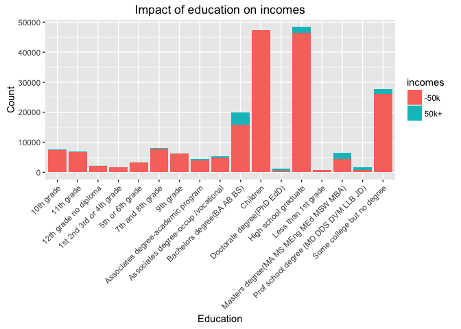

# US Census: Savings prediction
Molina Rafidison  
June 15, 2016  

# Introduction

## Introduction

This analysis aims to identify which people in the test dataset won more or less than $50,000 per year. 

## Preliminaries


### Reproducibility

Set the following seed to make sure the analysis is reproducible.


```r
seed <- 201606
```

Load the needed packages and install them if `FALSE`.


```r
packages <- c("ggplot2", "tabplot", "caret", "plyr", "dplyr")
sapply(packages, require, character.only = TRUE, quietly = TRUE)
```

```
## ggplot2 tabplot   caret    plyr   dplyr 
##    TRUE    TRUE    TRUE    TRUE    TRUE
```

### Getting and reading data

Download [the Internet-based file](http://thomasdata.s3.amazonaws.com/ds/us_census_full.zip) and read data.


```r
## Set path
path <- getwd()

## Download directory
if (!file.exists("us_census_full")) {
    fileUrl <- "http://thomasdata.s3.amazonaws.com/ds/us_census_full.zip"
    tempFile <- "Dataset.zip"
    download.file(fileUrl, file.path(path, tempFile))
    ## Unzipping
    unzip(file.path(path, tempFile))
    ## Deleting temporary compressed file
    unlink(tempFile)
}

## Read data
train <- read.csv(file.path(path, "us_census_full/census_income_learn.csv"), 
                  na.strings = c("NA", "#DIV/0!", ""))
test <- read.csv(file.path(path, "us_census_full/census_income_test.csv"), 
                 na.strings = c("NA", "#DIV/0!", ""))
info <- read.csv(file.path(path, "us_census_full/census_income_metadata.txt"),
                 header = FALSE)
```

Get an idea of the datasets dimensions.


```r
dim(train); dim(test)
```

```
## [1] 199522     42
```

```
## [1] 99761    42
```

### Rename variables

The variables names are all messed up. I would like them to match the ones we can read on the text files. This will simplify the exploration and manipulation later on.


```r
varName <- gsub("[\\(\\)]", "", regmatches(info[89:128, ], gregexpr("\\(.*?\\)", info[89:128, ])))
varName <- gsub(" ", "\\.", varName)

replaceName <- function(data) {
    dataName <- names(data)
    dataName[25] <- "instance.weight"
    dataName[42] <- "incomes"
    dataName[-c(25, 42)] <- varName
    return(dataName)
}

names(train) <- replaceName(train); names(test) <- replaceName(test)
```

### Adding missing values

We have some `?` and `Not in universe` in the data. In my context, I will just replace them with NAs and work on them if need be along with the analysis.


```r
misVal <- function(data) {
    dataList <- lapply(data, function(x) {gsub("\\?|Not in universe *.*", NA, x)})
    data <- as.data.frame(dataList)
    return(data)
}

train <- misVal(train); test <- misVal(test)
```

## Reviewing classes

Because of the previous change, I need to rewrite some of the variables' class. 


```r
contiVar <- c(1, 6, 17, 18, 19, 31, 40)
train[, contiVar] <- apply(train[, contiVar], 2, function(x) {as.integer(as.character(x))})
test[, contiVar] <- apply(test[, contiVar], 2, function(x) {as.integer(as.character(x))})
```

### Basic summary

Here we go with this data:


```r
summary(train)
```

```
##       age                               class.of.worker  
##  Min.   : 0.00    Private                       : 72028  
##  1st Qu.:15.00    Self-employed-not incorporated:  8445  
##  Median :33.00    Local government              :  7784  
##  Mean   :34.49    State government              :  4227  
##  3rd Qu.:50.00    Self-employed-incorporated    :  3265  
##  Max.   :90.00   (Other)                        :  3529  
##                  NA's                           :100244  
##  detailed.industry.recode detailed.occupation.recode
##  0      :100683           0      :100683            
##  33     : 17070           2      :  8756            
##  43     :  8283           26     :  7887            
##  4      :  5984           19     :  5413            
##  42     :  4683           29     :  5105            
##  45     :  4482           36     :  4145            
##  (Other): 58337           (Other): 67533            
##                        education     wage.per.hour    
##   High school graduate      :48406   Min.   :   0.00  
##   Children                  :47422   1st Qu.:   0.00  
##   Some college but no degree:27820   Median :   0.00  
##   Bachelors degree(BA AB BS):19865   Mean   :  55.43  
##   7th and 8th grade         : 8007   3rd Qu.:   0.00  
##   10th grade                : 7557   Max.   :9999.00  
##  (Other)                    :40445                    
##           enroll.in.edu.inst.last.wk
##   College or university:  5688      
##   High school          :  6892      
##  NA's                  :186942      
##                                     
##                                     
##                                     
##                                     
##                            marital.stat  
##   Divorced                       :12710  
##   Married-A F spouse present     :  665  
##   Married-civilian spouse present:84222  
##   Married-spouse absent          : 1518  
##   Never married                  :86485  
##   Separated                      : 3460  
##   Widowed                        :10462  
##                          major.industry.code
##   Retail trade                     : 17070  
##   Manufacturing-durable goods      :  9015  
##   Education                        :  8283  
##   Manufacturing-nondurable goods   :  6897  
##   Finance insurance and real estate:  6145  
##  (Other)                           : 51429  
##  NA's                              :100683  
##                      major.occupation.code
##   Adm support including clerical: 14837   
##   Professional specialty        : 13940   
##   Executive admin and managerial: 12495   
##   Other service                 : 12099   
##   Sales                         : 11783   
##  (Other)                        : 33685   
##  NA's                           :100683   
##                            race                          hispanic.origin  
##   Amer Indian Aleut or Eskimo:  2251    All other                :171906  
##   Asian or Pacific Islander  :  5835    Mexican-American         :  8079  
##   Black                      : 20415    Mexican (Mexicano)       :  7234  
##   Other                      :  3657    Central or South American:  3895  
##   White                      :167364    Puerto Rican             :  3313  
##                                         Other Spanish            :  2485  
##                                        (Other)                   :  2610  
##       sex         member.of.a.labor.union
##   Female:103983    No : 16034            
##   Male  : 95539    Yes:  3030            
##                   NA's:180458            
##                                          
##                                          
##                                          
##                                          
##            reason.for.unemployment
##   Job leaver           :   598    
##   Job loser - on layoff:   976    
##   New entrant          :   439    
##   Other job loser      :  2038    
##   Re-entrant           :  2019    
##  NA's                  :193452    
##                                   
##                    full.or.part.time.employment.stat capital.gains    
##   Children or Armed Forces          :123769          Min.   :    0.0  
##   Full-time schedules               : 40736          1st Qu.:    0.0  
##   Not in labor force                : 26807          Median :    0.0  
##   PT for non-econ reasons usually FT:  3322          Mean   :  434.7  
##   Unemployed full-time              :  2311          3rd Qu.:    0.0  
##   PT for econ reasons usually PT    :  1209          Max.   :99999.0  
##  (Other)                            :  1368                           
##  capital.losses    dividends.from.stocks
##  Min.   :   0.00   Min.   :    0.0      
##  1st Qu.:   0.00   1st Qu.:    0.0      
##  Median :   0.00   Median :    0.0      
##  Mean   :  37.31   Mean   :  197.5      
##  3rd Qu.:   0.00   3rd Qu.:    0.0      
##  Max.   :4608.00   Max.   :99999.0      
##                                         
##                        tax.filer.stat  region.of.previous.residence
##   Head of household           : 7426    Abroad   :   530           
##   Joint both 65+              : 8332    Midwest  :  3575           
##   Joint both under 65         :67383    Northeast:  2705           
##   Joint one under 65 & one 65+: 3867    South    :  4889           
##   Nonfiler                    :75093    West     :  4074           
##   Single                      :37421   NA's      :183749           
##                                                                    
##   state.of.previous.residence
##   California    :  1714      
##   Utah          :  1063      
##   Florida       :   849      
##   North Carolina:   812      
##   Abroad        :   671      
##  (Other)        :  9956      
##  NA's           :184457      
##                         detailed.household.and.family.stat
##   Householder                            :53248           
##   Child <18 never marr not in subfamily  :50326           
##   Spouse of householder                  :41695           
##   Nonfamily householder                  :22213           
##   Child 18+ never marr Not in a subfamily:12030           
##   Secondary individual                   : 6122           
##  (Other)                                 :13888           
##            detailed.household.summary.in.household instance.weight 
##   Householder                  :75475              1191.21:    32  
##   Child under 18 never married :50426              1601.4 :    32  
##   Spouse of householder        :41709              1787.34:    32  
##   Child 18 or older            :14430              753.23 :    32  
##   Other relative of householder: 9702              1317.51:    31  
##   Nonrelative of householder   : 7601              707.9  :    31  
##  (Other)                       :  179              (Other):199332  
##     migration.code.change.in.msa
##   Nonmover        : 82538       
##   MSA to MSA      : 10601       
##   NonMSA to nonMSA:  2811       
##   MSA to nonMSA   :   790       
##   NonMSA to MSA   :   615       
##  (Other)          :   956       
##  NA's             :101211       
##                  migration.code.change.in.reg
##   Nonmover                     : 82538       
##   Same county                  :  9812       
##   Different county same state  :  2797       
##   Different region             :  1178       
##   Different state same division:   991       
##  (Other)                       :   995       
##  NA's                          :101211       
##               migration.code.move.within.reg live.in.this.house.1.year.ago
##   Nonmover                   : 82538          No : 15773                  
##   Same county                :  9812          Yes: 82538                  
##   Different county same state:  2797         NA's:101211                  
##   Different state in South   :   973                                      
##   Different state in West    :   679                                      
##  (Other)                     :  1512                                      
##  NA's                        :101211                                      
##  migration.prev.res.in.sunbelt num.persons.worked.for.employer
##   No :  9987                   Min.   :0.000                  
##   Yes:  5786                   1st Qu.:0.000                  
##  NA's:183749                   Median :1.000                  
##                                Mean   :1.956                  
##                                3rd Qu.:4.000                  
##                                Max.   :6.000                  
##                                                               
##             family.members.under.18   country.of.birth.father
##   Both parents present  : 38983      United-States:159162    
##   Father only present   :  1883      Mexico       : 10008    
##   Mother only present   : 12772      Puerto-Rico  :  2680    
##   Neither parent present:  1653      Italy        :  2212    
##  NA's                   :144231      Canada       :  1380    
##                                     (Other)       : 17367    
##                                     NA's          :  6713    
##    country.of.birth.mother    country.of.birth.self
##   United-States:160478      United-States:176988   
##   Mexico       :  9781      Mexico       :  5767   
##   Puerto-Rico  :  2473      Puerto-Rico  :  1400   
##   Italy        :  1844      Germany      :   851   
##   Canada       :  1451      Philippines  :   845   
##  (Other)       : 17376     (Other)       : 10278   
##  NA's          :  6119     NA's          :  3393   
##                                        citizenship    
##   Foreign born- Not a citizen of U S         : 13401  
##   Foreign born- U S citizen by naturalization:  5855  
##   Native- Born abroad of American Parent(s)  :  1756  
##   Native- Born in Puerto Rico or U S Outlying:  1519  
##   Native- Born in the United States          :176991  
##                                                       
##                                                       
##  own.business.or.self.employed fill.inc.questionnaire.for.veteran.s.admin
##  0:180671                       No :  1593                               
##  1:  2698                       Yes:   391                               
##  2: 16153                      NA's:197538                               
##                                                                          
##                                                                          
##                                                                          
##                                                                          
##  veterans.benefits weeks.worked.in.year year            incomes      
##  0: 47409          Min.   : 0.00        94:99827    - 50000.:187140  
##  1:  1984          1st Qu.: 0.00        95:99695    50000+. : 12382  
##  2:150129          Median : 8.00                                     
##                    Mean   :23.18                                     
##                    3rd Qu.:52.00                                     
##                    Max.   :52.00                                     
## 
```

# Cleaning data

## Engineering features

For the purpose of this exercise and given the short timeframe, we will work only on a few variables. The analysis could be more thorough with further feature engineering though.
I also have to think that the following manipulations will have to appear on the test dataset too to properly train my models.

### Main outcome

The outcome `incomes` is a factor with two levels. Let's clean up its levels.


```r
cleanIncome <- function(curVar) {
    sapply(curVar, function(x) {
        if (x == " 50000+.") {
            curVar <- "50k+" 
        } else {
            curVar <- "-50k"
        }
    })
}

train$incomes <- cleanIncome(train$incomes)
train$incomes <- factor(train$incomes)

test$incomes <- cleanIncome(test$incomes)
test$incomes <- factor(test$incomes)
```

### Slicing ages

Let's look at the `age` variable. 


```r
ggplot(train, aes(x = incomes, y = age, group = incomes)) + 
    geom_boxplot() +
    labs(title = "Annual incomes according to age",
         x = "Annual incomes",
         y = "Age") 
```

<!-- -->

I create five levels to convert the `age` variable into a factor.


```r
sliceAge <- function(curVar, newVar) {
    sapply(curVar, function(x) {
        if (x < 16) {
            newVar <- "Child"
        } else if (x %in% 16:33) {
            newVar <- "Young adult"
        } else if (x %in% 34:52) {
            newVar <- "Adult"
        } else if (x %in% 53:64) {
            newVar <- "Senior adult"
        } else {
            newVar <- "Oldest"
        }
    })
}

train$ageType <- factor(sliceAge(train$age, train$ageType))
test$ageType <- factor(sliceAge(test$age, test$ageType))
```

### Giving degrees

Let's see how education impact the incomes. 


```r
ggplot(train, aes(x = education, fill = incomes)) + 
    geom_bar() + 
    theme(axis.text.x = element_text(angle = 45, hjust = 1)) +
    xlab("Education") +
    ylab("Count") +
    ggtitle("Impact of education on incomes")
```

<!-- -->

It might be interesting to create a variable that tells whether a person has a degree or not while keeping those who went to college and got no degree.


```r
sortDegree <- function(curVar, newVar) {
    noDegree <- levels(train$education)[c(1:7, 11, 14)]
    degree <- levels(curVar)[c(8:10, 12, 13, 15, 16)]
    sapply(curVar, function(x) {
        if (x %in% noDegree) {
            newVar <- "No degree"
        } else if (x %in% degree) {
            newVar <- "Degree"
        } else {
            newVar <- "College no degree"
        }
    })
}

train$degree <- factor(sortDegree(train$education, train$degree))
test$degree <- factor(sortDegree(test$education, test$degree))
```

### Identifying workers

The class of worker is interesting and could be more complete with an additional level for non-working people.


```r
levels(train$class.of.worker) <- c(levels(train$class.of.worker), "Non worker")
levels(test$class.of.worker) <- c(levels(test$class.of.worker), "Non worker")

train$class.of.worker[is.na(train$class.of.worker)] <- "Non worker"
test$class.of.worker[is.na(test$class.of.worker)] <- "Non worker"
```

On the other hand, being enrolled in education at that time can also impact the incomes. Let's create a `Student` variable.


```r
train$isStudent[is.na(train$enroll.in.edu.inst.last.wk)] <- "Non post-graduate student"
train$isStudent[!is.na(train$enroll.in.edu.inst.last.wk)] <- "Post-graduate student"
train$isStudent <- factor(train$isStudent)

test$isStudent[is.na(test$enroll.in.edu.inst.last.wk)] <- "Non post-graduate student"
test$isStudent[!is.na(test$enroll.in.edu.inst.last.wk)] <- "Post-graduate student"
test$isStudent <- factor(test$isStudent)
```

Now we differentiate levels based on the `Wage per hour` variable.


```r
sliceWage <- function(curVar, newVar) {
    sapply(curVar, function(x) {
        if (x < 20) {
            newVar <- "Nothing"
        } else if (x %in% 20:585) {
            newVar <- "20 to 585"
        } else if (x %in% 586:800) {
            newVar <- "586 to 800"
        } else if (x %in% 801:1200) {
            newVar <- "801 to 1200"
        } else {
            newVar <- "1201+"
        }
    })
}

train$wageClass <- factor(sliceWage(train$wage.per.hour, train$wageClass))
test$wageClass <- factor(sliceWage(test$wage.per.hour, test$wageClass))
```

And I finally convert the number of weeks worked in a year into a factor.


```r
train$weeks.worked.in.year <- factor(train$weeks.worked.in.year)
test$weeks.worked.in.year <- factor(test$weeks.worked.in.year)
```

### Counting gains

There are three variables that could strongly impact the income that are the different sources of gains or losses. To get a general idea of a person's status, I take the capital gains or losses and dividends to compute to know whether the trend is positive or negative.


```r
train$extGains <- train$capital.gains - train$capital.losses + train$dividends.from.stocks
test$extGains <- test$capital.gains - test$capital.losses + test$dividends.from.stocks

compGains <- cleanIncome <- function(curVar) {
    sapply(curVar, function(x) {
        if (x == 0) {
            curVar <- "Null" 
        } else if (x > 0) {
            curVar <- "Positive"
        } else {
            curVar <- "Negative"
        }
    })
}

train$extGains <- factor(compGains(train$extGains))
test$extGains <- factor(compGains(test$extGains))
```

### Looking at householders

I graph a barplot to observe any pattern with regards of the households details. 


```r
ggplot(train, aes(x = detailed.household.summary.in.household, fill = incomes)) + 
    geom_bar() + 
    theme(axis.text.x = element_text(angle = 45, hjust = 1)) +
    xlab("Detailed household") +
    ylab("Count") +
    ggtitle("Relationship between householders and incomes")
```

<!-- -->

Spotting householders or householders' spouses seem to be a good point to help us predict the income. I just would llike to modify the variable's name, which is long at the moment.


```r
names(train)[24] <- "householdSummary"
names(test)[24] <- "householdSummary"
```

## Observations

Once again, given the short timeframe, I had to make choices and decided not to go further with the feature engineering. Yet there are many things I would have study and here below is an overview.

### Annual income

I noticed that around half of the training dataset is based on 1994 and the other half on 1995. We could think that they are potentially the same population whose data were collected on these two consecutive years.


```r
ggplot(train, aes(x = year, fill = incomes)) + 
    geom_bar() + 
    xlab("Year") +
    ylab("Count") +
    ggtitle("Incomes per year")
```

<!-- -->

### Focus on migration

The data focuses a lot on the migration aspect. I noticed that some people who were born in specific countries (out of the USA) are more likely to have a 50k+ income like Hungary, Jamaica or Trinidad & Tobago.

### Closer relationships

There are many information crossed in multiple variables. I am quite sure that mixing some other variables could have been interesting to be even more accurate - people who have children, the number of children per household, where they live based on the migration code, and so on...

### Missing values

I replaced the "Not in universe" values with NAs but both are different. "Not in universe" means that the respondant was not concerned by the question asked. 
I could have study the real NAs and see whether it would have been relevant to impute the missing values.

# Model Selection

We want to predict the categorical outcome `incomes` and the data is labeled, meaning we would better work on classification methods. 

## Preping training data

### Final cleaning

I now need to choose the right variables to build my models. Reminder: I also have to remove the `instance.weight` variable as said in the text documentation.


```r
keepVar <- c(8, 11:13, 20, 24, 31, 36, 39, 40:47)
#  [1] "marital.stat"                    "race"                            "hispanic.origin"                
#  [4] "sex"                             "tax.filer.stat"                  "householdSummary"               
#  [7] "num.persons.worked.for.employer" "citizenship"                     "veterans.benefits"              
# [10] "weeks.worked.in.year"            "year"                            "incomes"                        
# [13] "ageType"                         "degree"                          "isStudent"                      
# [16] "wageClass"                       "extGains"  
```

I need to make sure all variables' classes are correct.


```r
train$marital.stat <- factor(train$marital.stat)
train$race <- factor(train$race)
train$hispanic.origin <- factor(train$hispanic.origin)
train$sex <- factor(train$sex)
train$tax.filer.stat <- factor(train$tax.filer.stat)
train$householdSummary <- factor(train$householdSummary)


for (i in 1:length(test) ) {
    colName <- names(test)[i]
    testType <- class(test[, colName])
    trainType <- class(train[, colName])
    if (trainType != "NULL" && testType != trainType) {
        if (trainType == "factor") {
            test[, colName] <- factor(test[, colName])
        } else {
            test[, colName] <- as.integer(test[, colName])
        }
    }
}
```

And apply the subsetting.


```r
cleanTrain <- train[, keepVar]
cleanTest <- test[, keepVar]
```

### Splitting data

We split the original training dataset into small training and testing sets, comprising respectively 80% and 20% of the observations. We will build our model on `subTrain` and test and asses its quality on `subTest`.


```r
set.seed(seed)
inTrain <- createDataPartition(y = cleanTrain$incomes, p = .8, list = FALSE)

subTrain <- cleanTrain[inTrain, -12]
subTrainLabel <- cleanTrain[inTrain, 12]

subTest <- cleanTrain[-inTrain, -12]
subTestLabel <- cleanTrain[-inTrain, 12]

dim(subTrain); dim(subTest)
```

```
## [1] 159618     16
```

```
## [1] 39904    16
```

### Cross-validation parameters

We train our model using the `caret` package. This allows me to keep the same general control parameters and to use the same approach for the models I test.


```r
tControl <- trainControl(method = "repeatedcv", 
                         number = 5, 
                         repeats = 2,
                         search = "grid")
```

## Simple decision tree

### Training model


```r
treeGrid <- expand.grid(cp = 0.0004542701)
```


```r
set.seed(seed)
require(e1071)
```

```
## Loading required package: e1071
```

```
## 
## Attaching package: 'e1071'
```

```
## The following object is masked from 'package:Hmisc':
## 
##     impute
```

```r
classTree <- train(x = subTrain,
                   y = subTrainLabel,
                   method = "rpart",
                   trControl = tControl,
                   tuneLength = 5)
```

```
## Loading required package: rpart
```

```r
print(classTree)
```

```
## CART 
## 
## 159618 samples
##     16 predictor
##      2 classes: '-50k', '50k+' 
## 
## No pre-processing
## Resampling: Cross-Validated (5 fold, repeated 2 times) 
## Summary of sample sizes: 127695, 127693, 127694, 127695, 127695, 127694, ... 
## Resampling results across tuning parameters:
## 
##   cp           Accuracy   Kappa    
##   0.001110438  0.9422246  0.3208365
##   0.001160913  0.9421713  0.3256649
##   0.002826570  0.9420084  0.3263654
##   0.004946497  0.9418800  0.3250259
##   0.008378760  0.9390388  0.1249515
## 
## Accuracy was used to select the optimal model using  the largest value.
## The final value used for the model was cp = 0.001110438.
```

### Checking predictions

Let's see how accurate it is on the pre-final test dataset.


```r
treeModel <- predict.train(classTree, newdata = subTest)
## Accuracy : 0.9424 Kappa : 0.3329

confusionMatrix(treeModel, subTestLabel)
```

```
## Confusion Matrix and Statistics
## 
##           Reference
## Prediction  -50k  50k+
##       -50k 36944  1814
##       50k+   484   662
##                                           
##                Accuracy : 0.9424          
##                  95% CI : (0.9401, 0.9447)
##     No Information Rate : 0.938           
##     P-Value [Acc > NIR] : 9.859e-05       
##                                           
##                   Kappa : 0.3396          
##  Mcnemar's Test P-Value : < 2.2e-16       
##                                           
##             Sensitivity : 0.9871          
##             Specificity : 0.2674          
##          Pos Pred Value : 0.9532          
##          Neg Pred Value : 0.5777          
##              Prevalence : 0.9380          
##          Detection Rate : 0.9258          
##    Detection Prevalence : 0.9713          
##       Balanced Accuracy : 0.6272          
##                                           
##        'Positive' Class : -50k            
## 
```

The accuracy does not look bad with 94%.

### Variables importance


```r
treeVarImp <- varImp(classTree)

dotPlot(treeVarImp)
```

<!-- -->

## Random Forest

Same approach for this famous model except that I have added two tuning parameters to the Random Forest algorithm: `mtry`and `ntree`. 


```r
set.seed(seed)
rfGrid <- expand.grid(mtry = )

rf <- train(x = subTrain,
            y = subTrainLabel,
            method = "rf",
            trControl = tControl,
            tuneLength = 5,
            ntree = ,
            tuneGrid = rfGrid)
```

These are the results based on the training set.


```r
print(rf)
```

### Checking predictions

Let's see how accurate it is on the pre-final test dataset.


```r
rfModel <- predict.train(classTree, newdata = subTest)

confusionMatrix(rfModel, subTestLabel)
```

The accuracy does not look bad with 94%.

### Variables importance


```r
rfVarImp <- varImp(rf)

dotPlot(rfVarImp)
```

# Outcome prediction

## Preping test dataset

Now that I have selected my best model, I need to separate the outcome from the rest of the dataset.


```r
finalTest <- cleanTest[, -12]
finalTestLabel <- finalTest[, 12]
```

## Final predictions

Finally we can try out the selected model on the final test dataset.


```r
rfModelPred <- predict.train(rfModel, newdata = finalTest)
```

## Comparison


```r
confusionMatrix(rfModelPred, finalTestLabel)
```

# Challenges

## Short timeframe

My biggest challenge was to complete the exercise within a day. The points that takes me time are:
- Reading the documentation several times to anticipate some questions I might have later on;
- Exploring and cleaning the data as I graph many plots and observe the data again and again;
- Waiting for the models to be trained.

## Sacrifying variables

I knew I could not complete a work as thorough I would have liked. So I had to make 'sacrifices' and choose the variables I had to work on and the ones I had to leave. 
I took the variables that needed some feature engineering and that are accessible. Even though I ended up with this report, I know I could make a more thorough analysis.

